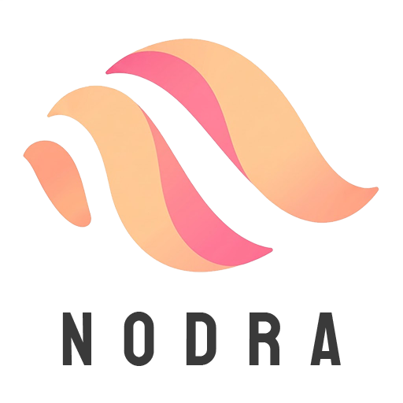

<p align="center">
  
</p>

# Nodra

**[Watch the demo on YouTube](https://www.youtube.com/watch?v=BM-pM-0AHjk)**

A simplified, code-first node network for generating meshes in Unity, in the Editor or at runtime - edited as a
visual node graph.

A `GeoGraph` is a collection of **GeoNode**s (generators, modifiers, scatter/copy, merge) wired together by edges; each
node pulls its input(s) - a shared `GeoData` (points + polygon primitives) - from whatever's connected to its input
port(s), and the result is baked into a `Mesh` at the end. Edit the graph visually in the **Nodra Graph** window.

## Nodes

#### Generators

- `GridGeneratorNode` — a flat, subdivided plane (needs the bundled `NodraCore` native library)
- `HeightMapGeneratorNode` — a terrain-like plane shaped by a heightmap texture
- `BoxGeneratorNode` — a box (needs the bundled `NodraCore` native library)
- `SphereGeneratorNode` — a sphere (needs the bundled `NodraCore` native library)
- `IcoSphereGeneratorNode` — a sphere with even, non-pinched triangles (needs the bundled `NodraCore` native library)
- `CircleGeneratorNode` — a flat disc (needs the bundled `NodraCore` native library)
- `CylinderGeneratorNode` — a cylinder or cone (needs the bundled `NodraCore` native library)
- `TorusGeneratorNode` — a torus (donut shape) (needs the bundled `NodraCore` native library)
- `LineGeneratorNode` — a straight line of points
- `SplineGeneratorNode` — a smooth curved path of points, editable directly in the Scene view (needs the bundled `NodraCore` native library)
- `SubGraphNode` — reuses another `Geo Graph` asset's result (see [Sub-graphs](#sub-graphs) below)

#### Modifiers

- `TransformNode` — moves, rotates and scales the mesh
- `NoiseDisplaceNode` — roughens the surface with noise (needs the bundled `NodraCore` native library)
- `ExtrudeNode` — pushes the surface outward into a solid shape (needs the bundled `NodraCore` native library)
- `ChamferNode` — softens sharp edges with a small bevel (needs the bundled `NodraCore` native library)
- `TubeNode` — wraps a tube or beam around a path (needs the bundled `NodraCore` native library)
- `ArrayNode` — repeats the mesh in a row, ring or spiral (needs the bundled `NodraCore` native library)
- `MirrorNode` — mirrors the mesh across an axis (needs the bundled `NodraCore` native library)
- `TaperNode` — narrows or widens the mesh along an axis
- `BendNode` — curves the mesh into an arc (needs the bundled `NodraCore` native library)
- `TwistNode` — twists the mesh around an axis
- `RelaxNode` — smooths out jagged geometry (needs the bundled `NodraCore` native library)
- `SubdivideNode` — adds extra detail to the mesh (needs the bundled `NodraCore` native library)
- `SliceNode` — cuts the mesh flat with a plane, optionally capping the cut
- `FaceFilterNode` — removes faces facing a chosen direction (needs the bundled `NodraCore` native library)
- `DeletePointsNode` — drops points by a custom value (from SetAttributeNode) or at random, taking their faces with them (Random mode needs the bundled `NodraCore` native library)
- `DecimateNode` — reduces the mesh's triangle count (needs an optional extra package)

#### Geometry fixers

- `FlipNormalsNode` — turns the mesh inside out
- `WeldNode` — merges nearby duplicate points together (needs the bundled `NodraCore` native library)
- `SmoothByAngleNode` — smooths or facets shading based on edge angle (needs the bundled `NodraCore` native library)
- `CapHolesNode` — fills open holes in the mesh (needs the bundled `NodraCore` native library)
- `RemoveUnusedPointsNode` — drops points no face references anymore (e.g. after FaceFilterNode or SliceNode)

#### Color/UV

- `AutoUVNode` — generates simple UVs automatically (needs the bundled `NodraCore` native library)
- `UVTransformNode` — rotates, tiles and offsets the UVs
- `VertexColorNode` — paints the mesh with a flat color or gradient (Gradient mode needs the bundled `NodraCore` native library)
- `SetAttributeNode` — writes a custom per-point value (height, slope, noise, random...) other nodes can read by name

#### Scatter/copy

- `ScatterNode` — scatters points across a surface (needs the bundled `NodraCore` native library)
- `CopyToPointsNode` — stamps a mesh at each scattered point, optionally sized by a custom per-point value (needs the bundled `NodraCore` native library)
- `RandomTransformNode` — jitters position and tilt, e.g. so scattered copies don't sit razor-precise on the surface

#### Combine

- `MergeNode` — combines two meshes into one
- `BooleanNode` — cuts or combines two shapes like real solids (a real boolean between two connected inputs needs the bundled `NodraCore` native library)

## How to use

Add a `ProceduralMeshGenerator` component (requires a `MeshFilter`) to a GameObject, then click **Open Graph
Editor** in its inspector. Right-click the graph canvas to add nodes. 

The final mesh is rebuilt from `Geometry Output` node (marked green).

A **Preview** panel floats over the bottom-right of the canvas with a live, orbitable view of the graph's current
result (drag to rotate, scroll to zoom). On a `ProceduralMeshGenerator`, it updates as you edit only while **Auto
Generate** is on - with it off, the preview freezes at whatever it last showed until you click **Generate**, so it
never runs ahead of the actual baked mesh. A standalone `Geo Graph` asset (see [Sub-graphs](#sub-graphs)) has no
Auto Generate/Generate of its own, so its preview always stays live.

Turn on **Auto Generate** (in the graph window's toolbar, or the component's inspector) to have the mesh rebuild
automatically on every graph edit.

Turn on **Show Normals** (in the inspector) to draw a Scene view line per vertex along the baked `Mesh`'s own
normal (shows the `Mesh.normals` the renderer uses) - useful for checking a generator's winding or
`SmoothByAngleNode`'s result actually looks faceted/smooth where expected. 

**Save Mesh to Project...** (in the inspector) regenerates and saves the current
result as a `.asset` file, so it survives as a normal project asset instead of only living as an in-memory Mesh on
the MeshFilter. A `Geo Graph` asset has the same button in its own inspector.

**Export to FBX...** (in the inspector, next to Save Mesh) exports the current result as a `.fbx` file for use
outside Unity (Blender, Maya, 3ds Max, ...) - needs Unity's own [FBX
Exporter](https://docs.unity3d.com/Packages/com.unity.formats.fbx@latest) package installed (**Window → Package
Manager → + → Add package by name... → `com.unity.formats.fbx`**); without it, the button explains how to install
it instead of exporting. A `Geo Graph` asset has the same button.

### Sub-graphs

Create a shared, reusable graph via **Create → Nodra → Geo Graph** - it opens in the same graph editor (double-click
the asset, or use its **Open Graph Editor** button). Add a `SubGraphNode` anywhere and point its `Sub Graph` field at
that asset to reuse its result - the same asset can be referenced from as many graphs as you like, on any object or
scene. Its own **Open** button jumps straight into editing the referenced asset.

A `Geo Graph` asset has no `Auto Generate`/`Generate` of its own (there's no Mesh or Transform to bake into) - editing
it doesn't automatically regenerate whatever elsewhere references it via `SubGraphNode`; click that object's own
**Generate** (or nudge one of its fields with `Auto Generate` on) to pick up the change.

### NodraCore native library

`WeldNode`, `SmoothByAngleNode`, `NoiseDisplaceNode`, `ArrayNode`, `AutoUVNode`, `BendNode`, `CapHolesNode`,
`ChamferNode`, `CircleGeneratorNode`, `CopyToPointsNode`, `ExtrudeNode`, `FaceFilterNode`, `IcoSphereGeneratorNode`,
`MirrorNode`, `RelaxNode`, `ScatterNode`, `SubdivideNode`, `SplineGeneratorNode`, `TubeNode`, `BooleanNode`,
`UVTransformNode`, `TaperNode`, `MergeNode`, `FlipNormalsNode`, `LineGeneratorNode`, `TwistNode`, `TransformNode`,
`RandomTransformNode`, `SliceNode`, `SetAttributeNode`, `RemoveUnusedPointsNode`, `BoxGeneratorNode`,
`SphereGeneratorNode`, `GridGeneratorNode`, `TorusGeneratorNode` and `CylinderGeneratorNode` run entirely inside
`NodraCore` - a small native library bundled at `Sources/Plugins/` (built from source in `Native/NodraCore` at
the repo root, compiled ahead-of-time, not a normal managed .NET assembly). It ships for desktop Editor **and**
Standalone (Windows/macOS/Linux) - it's meant to run in a built Player, not just power the graph editor. Without
it available for the current platform (not yet built for it, or the Plugin Inspector isn't set up for it), these
nodes stay in the graph but do nothing useful instead - every modifier in that list passes its input through
unchanged, the generators produce no geometry at all (there's no existing input for a generator to fall back to)
- the node itself shows a warning box explaining why, same as `DecimateNode` below when its own dependency is
missing. `DeletePointsNode`'s **Random** mode, `VertexColorNode`'s **Gradient** mode, `BooleanNode` with only one
input connected, `MergeNode` with **Branch** unconnected, and `SetAttributeNode` with anything but **Constant**
mode are the exceptions that only PARTLY (or don't at all, for `BooleanNode`/`MergeNode`) depend on it -
`DeletePointsNode`'s **Attribute** mode, `VertexColorNode`'s **Flat** mode, `BooleanNode` with one side
unconnected, `MergeNode` with no Branch, and `SetAttributeNode`'s **Constant** mode never needed NodraCore and
keep working regardless.

`NoiseDisplaceNode`'s **Perlin** option in particular is worth knowing about separately: it no longer tries to
match `Mathf.PerlinNoise`'s own output once NodraCore is available - that function runs inside Unity's own
closed-source engine and has no publicly reproducible equivalent outside it - so it switches to a different,
from-scratch gradient noise instead. A graph built with **Perlin** noise will look visibly different (same rolling
character, different specific bumps) the first time it's opened somewhere NodraCore is present, compared to
before. **Voronoi** is unaffected either way - it was always Nodra's own algorithm.

`CopyToPointsNode`'s **Align To Normal** has a similarly narrow exception: Unity's own `Quaternion.FromToRotation`
is also a closed-source native engine call with no reproducible algorithm. Every point normal except one direction
still gets the single mathematically correct alignment; only a point whose normal lands EXACTLY straight down (the
underside of a perfectly flat surface, which comes up often enough in practice) has no unique answer, and NodraCore
picks a fixed, documented orientation there instead of guessing at Unity's own. Existing graphs stamping copies on
an exactly-downward-facing surface may see those specific copies rotated differently once NodraCore is available -
every other direction is unaffected.

### Optional: DecimateNode

`DecimateNode` lives in its own `Nodra.Decimate` assembly and needs
[UnityMeshSimplifier](https://github.com/Whinarn/UnityMeshSimplifier) (MIT) installed separately - it isn't
bundled, and nothing else in Nodra needs it. Without it installed: no compile error, and a graph that already has
a `DecimateNode` in it keeps working - the node itself stays put, showing a warning box right in its own body in
the graph editor and passing its input through unchanged instead of decimating (you'll also see one harmless
console warning about the unresolved package reference). 

To install: **Window → Package Manager → + → Install package from git URL...** and paste
`https://github.com/Whinarn/UnityMeshSimplifier.git`.

### Optional: FBX Export

**Export to FBX...** needs Unity's own [FBX Exporter](https://docs.unity3d.com/Packages/com.unity.formats.fbx@latest)
package (`com.unity.formats.fbx`) installed - it isn't bundled, and nothing else in Nodra needs it. Without it
installed, the button shows a dialog explaining how to install it instead of exporting; no compile error either way.

To install: **Window → Package Manager → + → Add package by name...** and enter `com.unity.formats.fbx`.

## Creating custom nodes

To add your own node, derive from `GeoNode` and implement `Process(GeoData input)` (or `Process(GeoData[] inputs)`
for more than one input port) - it'll automatically show up in the graph's "Create Node" menu, filed under
whichever submenu its `Category` override names (defaults to "Modifiers" if you don't override it).

```cs
using Nodra;

var generator = gameObject.AddComponent<ProceduralMeshGenerator>();

var grid = new GridGeneratorNode { Size = new Vector2(20, 20), Resolution = new Vector2Int(20, 20) };
var noise = new NoiseDisplaceNode { Amplitude = 2f, Frequency = 0.15f };
var extrude = new ExtrudeNode { Distance = 1.5f };

generator.Graph.Nodes.Add(grid);
generator.Graph.Nodes.Add(noise);
generator.Graph.Nodes.Add(extrude);
generator.Graph.Edges.Add(new GeoEdge { FromNodeId = grid.Id, ToNodeId = noise.Id, ToPortIndex = 0 });
generator.Graph.Edges.Add(new GeoEdge { FromNodeId = noise.Id, ToNodeId = extrude.Id, ToPortIndex = 0 });

generator.Generate();
```

## License

GPLv3 - see [LICENSE](LICENSE).
